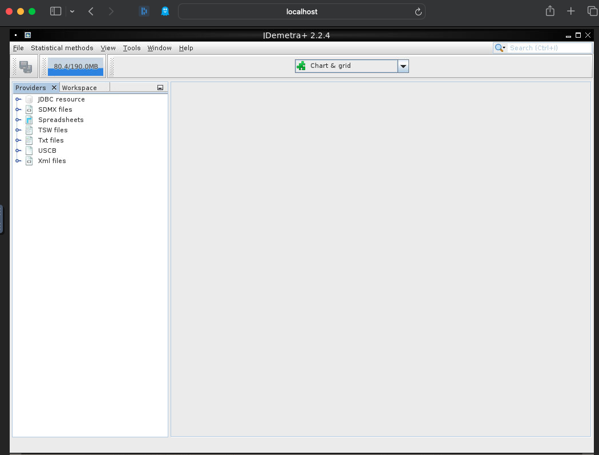

# JDemetra+ Docker Setup

JDemetra+ is an open-source software application developed by the National Bank of Belgium in collaboration with the Deutsche Bundesbank and Eurostat for seasonal adjustment and time series analysis. It implements TRAMO/SEATS+ and X-12ARIMA/X-13ARIMA-SEATS methods and is officially recommended by the European Statistical System. The tool is designed for extensibility and reusability in Java, running on multiple platforms with Java SE 8 or later. For more details, visit the [JDemetra+ GitHub page](https://github.com/jdemetra/jdemetra-app).

This repository contains the Docker setup for JDemetra+, including a noVNC setup for easy web access.



## Getting Started

Follow these instructions to set up JDemetra+ in a Docker container using noVNC for web access.

### Prerequisites

- Docker installed on your machine. [Download Docker](https://www.docker.com/products/docker-desktop)
- Internet connection for downloading the JDemetra+ binary and pushing the Docker image.
- Access to a Docker registry (like Docker Hub) and permission to push to the `trygu` namespace. Change namespace if you use your own. 

### Installation

1. **Clone the Repository**: Start by cloning this repository to your local machine.

    ```bash
    git clone https://github.com/trygu/jdemetra-docker.git
    cd jdemetra-docker
    ```

2. **Build and Push Docker Image**: Run the `build_and_fetch.sh` script to download the latest JDemetra+ binary, build the Docker image, and push it to the registry.

    ```bash
    chmod +x build_and_fetch.sh
    ./build_and_fetch.sh
    ```

   Make sure you are logged into your Docker registry before running this script.

### Docker Image

The Docker image, named `trygu/nbdemetra:0.7`, includes JDemetra+ version 2.2.4 and a noVNC setup for web access.

### Usage

After building and pushing the image to the registry, run a container with the following command:

```bash
docker run run --tmpfs /tmp/.X11-unix:rw,nosuid,nodev,noexec,relatime,size=65536k -d -p 5900:5900 -p 6080:6080 trygu/nbdemetra:0.7
```

or this command to run it without VNC access:

```bash
docker run run --tmpfs /tmp/.X11-unix:rw,nosuid,nodev,noexec,relatime,size=65536k -d -p 6080:6080 trygu/nbdemetra:0.7
```

This command only exposes the noVNC port.

This command maps the container's VNC port 5900 and noVNC port 6080 to the same ports on your host machine, allowing you to access JDemetra+:

- **VNC Access**: Use a VNC client to connect to `localhost:5900`.
- **noVNC Access**: Open a web browser and go to `http://localhost:6080`.
