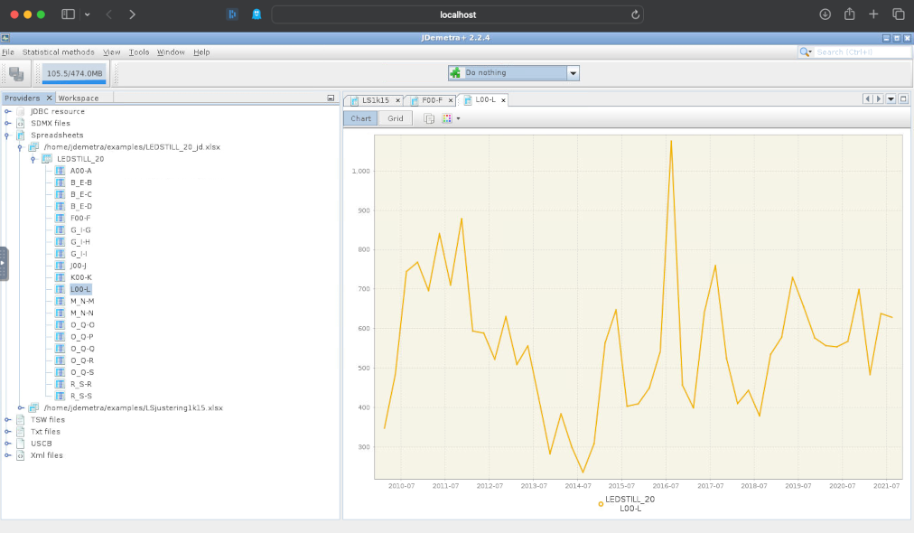

# JDemetra+ Docker Setup

JDemetra+ is an open-source software application developed by the National Bank of Belgium in collaboration with the Deutsche Bundesbank and Eurostat for seasonal adjustment and time series analysis. It implements TRAMO/SEATS+ and X-12ARIMA/X-13ARIMA-SEATS methods and is officially recommended by the European Statistical System. The tool is designed for extensibility and reusability in Java, running on multiple platforms with Java SE 8 or later. For more details, visit the [JDemetra+ GitHub page](https://github.com/jdemetra/jdemetra-app).

This repository contains the Docker setup for JDemetra+, including a noVNC setup for easy web access.



## Getting Started

Follow these instructions to set up JDemetra+ in a Docker container using noVNC for web access, now configured without a password for ease of access.

### Installation

1. **Clone the Repository**: Begin by cloning this repository to your local machine.

    ```bash
    git clone https://github.com/trygu/jdemetra-docker.git
    cd jdemetra-docker
    ```

2. **Build and Push Docker Image**: Execute the `build_and_fetch.sh` script to download the latest JDemetra+ binary, build the Docker image, and push it to the registry.

    ```bash
    chmod +x build_and_fetch.sh
    ./build_and_fetch.sh
    ```

   Ensure you are logged into your Docker registry before executing this script.

### Docker Image

The Docker image `trygu/nbdemetra:0.7` incorporates JDemetra+ version 2.2.4 and a noVNC setup for web access, now functioning without a password.

### Usage

After the image is built and pushed to the registry, initiate a container using the following command:

```bash
docker run --tmpfs /tmp/.X11-unix:rw,nosuid,nodev,noexec,relatime,size=65536k -d -p 5900:5900 -p 6080:6080 trygu/nbdemetra:1.0
```

Alternatively, use this command for operation without VNC access:

```bash
docker run --tmpfs /tmp/.X11-unix:rw,nosuid,nodev,noexec,relatime,size=65536k -d -p 6080:6080 trygu/nbdemetra:1.0
```

These commands, particularly the first one, map the container's VNC port 5900 and noVNC port 6080 to the same ports on your host machine. This modification allows access to JDemetra+ without the need for a password:

- **VNC Access**: Connect via a VNC client to `localhost:5900`. No password is required.
- **noVNC Access**: Navigate to `http://localhost:6080` in a web browser for direct access without a password.
